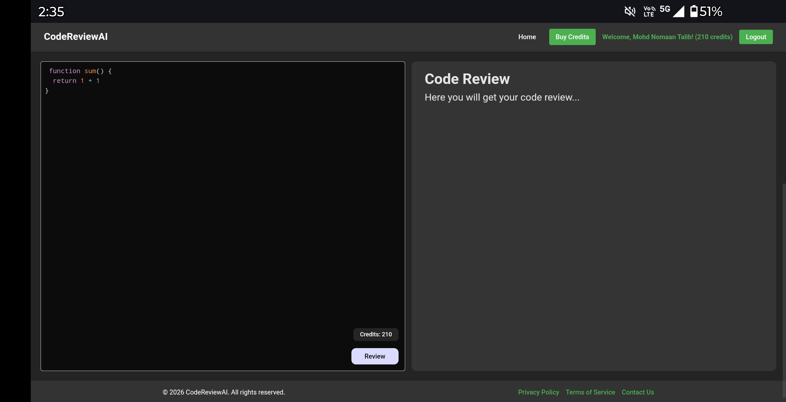
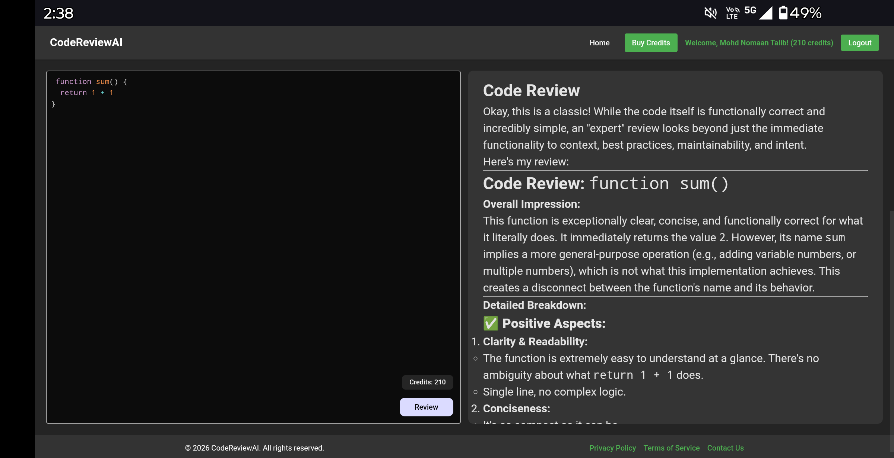
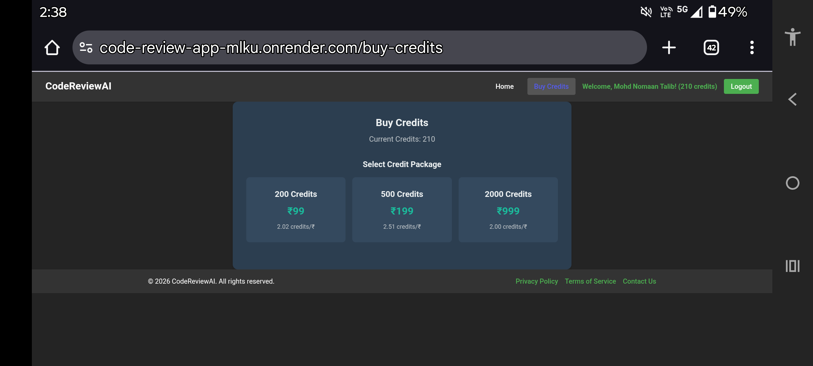
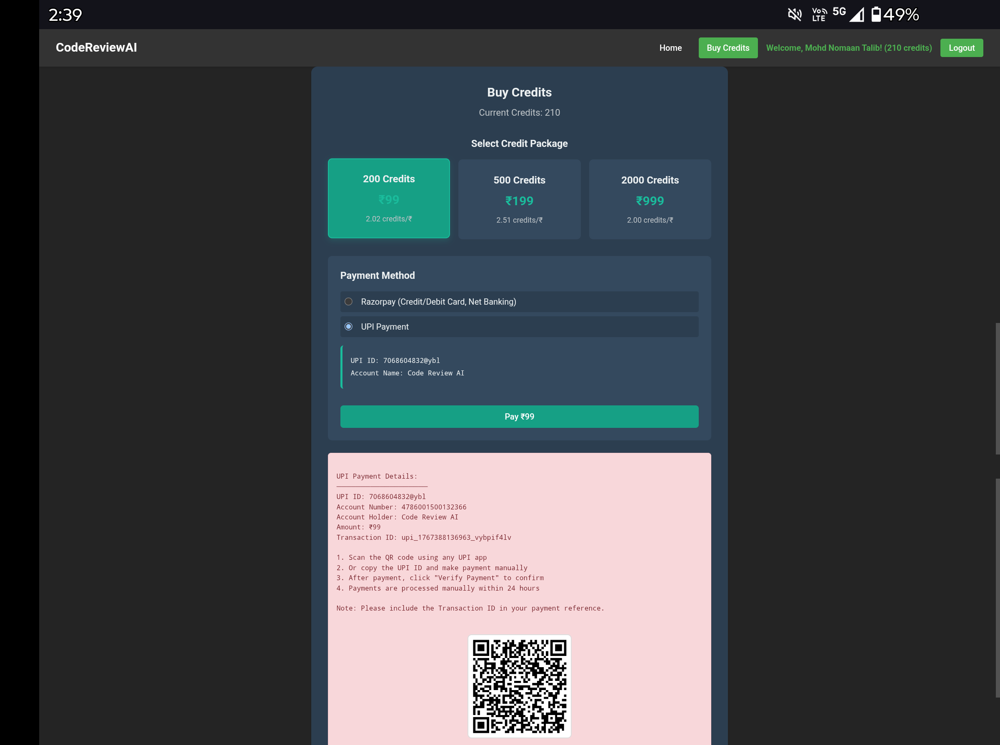
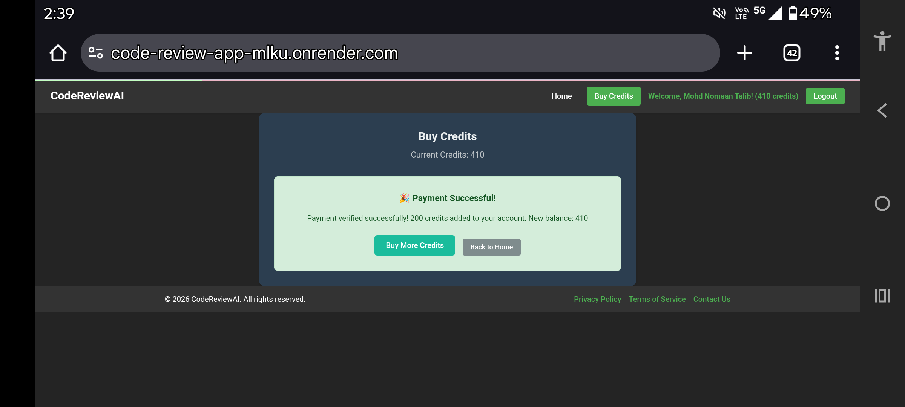

# CodeReviewAI – AI Powered Code Review Platform

CodeReviewAI is a full-stack AI-powered web application that analyzes source code and provides detailed, expert-level feedback using Generative AI.  
It includes authentication, a credit-based usage system, and real payment integration.

 **Live Demo:**  
https://code-review-app-mlku.onrender.com

---

##  Key Features

-  User Authentication (Login / Signup)
-  AI-powered code review & suggestions
-  Live code editor with syntax highlighting
-  Credit-based usage system
-  UPI & Razorpay payment integration
-  Payment verification & instant credit update
-  Fully deployed on Render

---

##  Tech Stack

**Frontend**
- React.js
- Tailwind CSS
- Axios

**Backend**
- Node.js
- Express.js
- Google Gemini API

**Database**
- MongoDB

**Deployment**
- Render

---

##  Application Screenshots

>  *Below screenshots demonstrate the complete user flow from login to payment and AI code review.*

---

###  Login Page
```md

```
### Code Review – Input Editor
```md

```
### Code Review – AI Output
```md

```
### Buy Credits Page
```md

```
### UPI Payment & QR Flow
```md

```
### Payment Success & Credit Update
```md

```
##  Run Locally

###  Clone the Repository
```bash
git clone https://github.com/nomaantalib/code-review-app.git
cd code-review-app
```
### Backend 
```bash
cd backend
npm install
```
### Frontend 
``` bash
cd ../frontend
npm install
```
###Environment Variables
> *Create a .env file inside the backend folder:*
#### Env
```bash
PORT=3000
MONGO_URI=your_mongodb_uri
GEMINI_API_KEY=your_gemini_api_key
```
### Start backend 
```bash
node server.js
```
### Start frontend 
```bash
npm run dev
```
